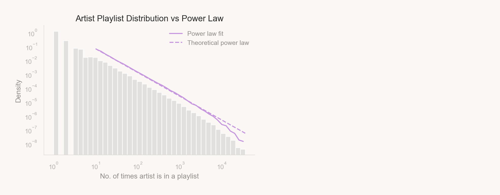

# 🎧 Music RecSys with Metaflow

This repository contains code following the [Recommender Systems with Metaflow](https://outerbounds.com/docs/recsys-tutorial-overview/) tutorial[^1].

## Motivation

> **Can we suggest what to listen to next after a given song?**

Here I learn how to use DuckDB, Gensim, Metaflow, and Keras to build an end-to-end recommender system. The model learned from existing sequences (playlists by real users) how to continue extending an arbitrary new list. More generally, this task is also known as next event prediction (NEP). The modeling technique only leverage behavioral data in the form of interactions created by users when composing their playlists.

[^1]: I've made some changes to the original tutorial to make it more readable, organized and/or robust.

## Data

Music is ubiquitous in today's world-almost everyone enjoys listening to music. With the rise of streaming platforms, the amount of music available has substantially increased. While users may seemingly benefit from this plethora of available music, at the same time, it has increasingly made it harder for users to explore new music and find songs they like. Personalized access to music libraries and music recommender systems aim to help users discover and retrieve music they like and enjoy.

The used dataset is based on the subset of users in the #nowplaying dataset who publish their #nowplaying tweets via Spotify. In principle, the dataset holds users, their playlists and the tracks contained in these playlists.

The dataset can be downloaded [here](https://www.kaggle.com/datasets/andrewmvd/spotify-playlists?resource=download).

### Distribution
The following plots show the distribution of artists and songs in the final dataset.

Unsurprisingly, the majority of artists have few or no songs in users playlists and just a handful of the them appear more than 10k times in the dataset's playlists.

Given this behavior, we can use the [`powerlaw`](https://github.com/jeffalstott/powerlaw) package to compare the distribution of how artists are represented in playlists to a power law density function.

## Model

## Pipeline

## Conclusion

In this little project we learned to:

- take a recommender system idea from prototype to real-time production;
- leverage Metaflow to train different versions of the same model and pick the best one;
- use Metaflow cards to save important details about model performance;
- package a representation of your data in a keras object that you can deploy directly from the flow to a cloud endpoint with AWS Sagemaker.
